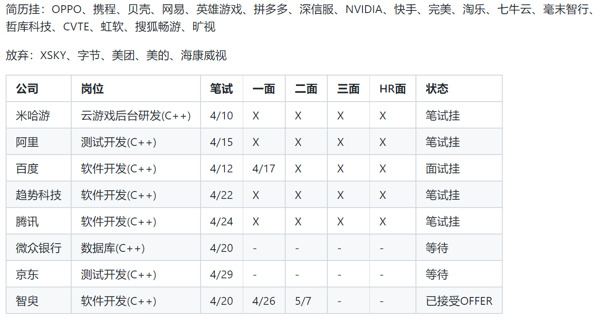

距离上一篇博客已经过去整整六个半月了，实在是摸鱼摸太久了。在上一篇博文的末尾，我写到我希望能赶紧找到一份c++后端开发的实习，我也确实完成了这个目标，不过侧重点已经不是c++后端而是数据库开发了。感觉跟做梦一样，半年前我几乎从来没有考虑过这个方向，而且我面试的时候甚至没有数据库基础，而现在我几乎每天口头都挂着数据库 XD

## 寒假的结束和准备的失败

寒假没有什么好说的，回一趟老家差不多十天，此外刷了本《剑指Offer》，刷了 Leetcode 的 Top 100 题单的一半，复习了下 C++ 和基础知识就差不多结束了。后来回想，我觉得要是我从那时候多刷点题就好了，寒假的时候过的还是太悠哉了。

我以前就认为刷题是很重要，但又觉得面试前一两个月开始刷就够了（疑惑？），所以一直没有放到心上，但实际上面试前一两个月再刷题基本就被死刑了 XD，现在的好公司都要 Medium 稳过，部分公司甚至会给 Hard 难度的题，真是吓人。。

寒假的时候我有点狂，起因是我看了看那些大厂的暑期实习面经，感觉问的不是多难，就是广度有点广，觉得自己好好背面经刷刷题，基本就能稳进了，但事实证明是我太狂妄了，我甚至笔试都过不了关，离谱hh

## 自闭的投简历

来到三月份，我发现刷的题实在不够看，基础知识复习的也不大行，就决定推迟投简历，等复习差不多了发现已经到了四月份。与往年不同，由于22年的裁员浪潮，很多部门都锁HC了，很多公司3月份就差不多招满人了，4月份才开始投简历的我可以说是直接泡进了池子里。。。

然后就是痛苦的投简历时间，我平均一周投十家公司，主要是 C++ 后端/服务器开发这方面，然后一周也会收到三四个笔试，然后就没然后了。一些公司确实是因为我笔试太烂没办法，但有一些公司我明明都全做出来了最后也没有给面试机会，总是就是非常卷。

后来我放下了矜持开始投一些我认为的小公司（其实都是些中大型公司，只是我没听说过而已。。），心想小公司只要给面试我基本都能稳进吧，然后搞心态的是竟然没有一家小公司给我面试机会(因为那些其实都不是小公司 XD)

这是我暑期实习投的全部公司：

虽然如此痛苦，但生活还是要继续，就是菜如我，只要多投总还是会有些收获。到了最后有三家公司给了我面试机会，分别是百度、海康威视、XSKY和智臾科技。

## 失败的面试

第一个给面试机会的是百度，在4月17日的上午，我早早的打开链接等待面试。面试官是个帅哥，声音也很好听，人也很礼貌，不过我的面试并不会因为这些而成功 XD

我犯了非常非常多的错误。。。首先是开始问我平时用什么语言写代码，我面的 C++ 岗位，但我脑子一抽说我平时都拿 C 写，C++ 写的一般，面试官肉眼可见的尬了一下。然后是一个代码题让我实现一个简单的 shared_ptr，说实话这个没什么难度，非常简单的泛型知识加上个引用计数控制析构就行，但当时脑子抽了一下子没思路就放弃了，苦鲁西！之后的基础题答得都不错，算法题给了个很简单的快排三分钟写完了(不过估计当时已经放弃我了。。)最后问我了不了解 C++ 并发，说实话这我有些无语，POSIX API 那些并发我还会写一些，C++ 并发我当时用都没用过，于是自然而然地挂了。

## 成功的面试

## 其他的面试

接了推友的内推去试试 XSKY，感谢推友。是做云服务和存储相关的公司，感觉挺不错的，跟hr电话聊了下公司之后安排了笔试。很有特色的是 XSKY 的笔试题没有算法题，而是一些贴合实际的编码题，而且更好的是他家的笔试有很多系统知识的问答题，我当时答的非常畅快，感觉这才应该是计算机笔试的重点，而不是做算法题嘤嘤嘤。

当然缺点是这些题有点过于简单了 XD。很快就收到了面试邀请，但可惜的是就在刚刚我已经接受了智臾的 offer，虽然接着面当练手也不错，但总感觉这是推友给我内推的我这样不大厚道，于是拒了，不过打算秋招再投一次 XSKY 试试hh

另外一家海康威视就完全不是这样了，我稍微了解了下海康这家公司，发现这家公司盛行 pua 文化，好多推友在面试的时候就被 pua 气的不行，吓得我赶紧拒了体面厂的面试邀请逃命~

## 随着找到实习，大三下也结束了

